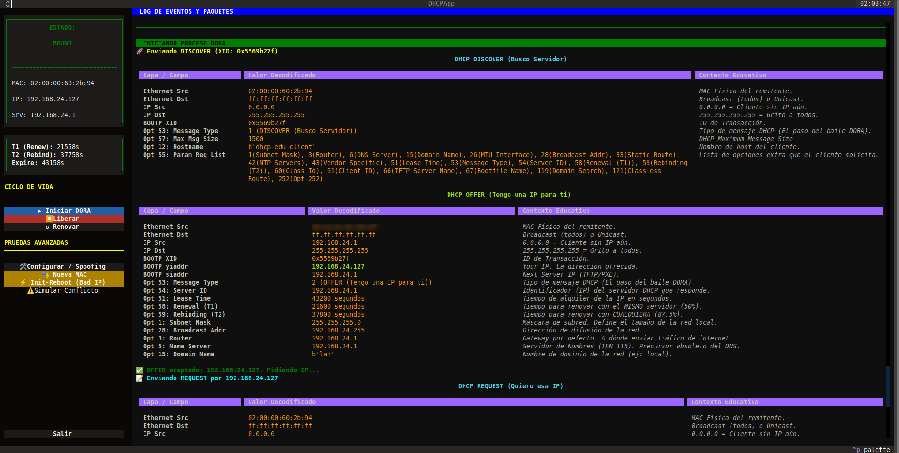

# DHCP EDU CLI - Simulador Académico de Cliente DHCP

Este proyecto es un simulador de cliente DHCP (v4) implementado en Python utilizando **Scapy** para la inyección/captura de paquetes y **Textual** para la interfaz TUI.

Diseñado con un enfoque estrictamente académico y forense, esta herramienta no se limita a obtener una IP, sino que implementa la máquina de estados completa del **RFC 2131** y los mecanismos de detección de conflictos del **RFC 5227**. Permite visualizar, manipular y "sabotear" el proceso DORA en tiempo real para fines educativos y de diagnóstico de redes.



## 📋 Funcionalidades

### Núcleo del Protocolo (RFC 2131)
*   **Ciclo DORA Completo:** Implementación transparente de DISCOVER, OFFER, REQUEST y ACK.
*   **Máquina de Estados Finita:** Visualización en tiempo real de los estados del cliente (`INIT`, `SELECTING`, `REQUESTING`, `BOUND`, `RENEWING`, `REBINDING`).
*   **Ciclo de Vida del Lease:**
    *   Cálculo y ejecución automática de temporizadores **T1** (Renovación Unicast) y **T2** (Rebinding Broadcast).
    *   Gestión de expiración de concesión y retorno a `INIT`.
*   **Transiciones de Estado Correctas:** Manejo diferencial de tráfico Unicast vs Broadcast según el estado del cliente.

### Integridad y Defensa de IP (RFC 5227)
*   **ARP Probe (Post-ACK):** Verificación automática de disponibilidad de la IP antes de su asignación final.
*   **Gratuitous ARP (Announcement):** Anuncio de la IP a la red tras la confirmación exitosa.
*   **Manejo de DHCP DECLINE:** Capacidad de rechazar una IP asignada por el servidor si se detecta uso previo en la red.
*   **Defensa Activa:** Respuesta automática a peticiones ARP y Echo Request (Ping) dirigidas a la IP obtenida.

### Simulación y Sabotaje (Modo Educativo)
*   **Simulación de Conflictos:** "Botón de Sabotaje" que fuerza un falso positivo en la detección ARP, provocando el envío de paquetes `DHCP DECLINE` reales al servidor (forzando al servidor a marcar IPs como *BAD_ADDRESS*).
*   **Spoofing Avanzado:**
    *   Cambio de dirección MAC en caliente.
    *   Personalización de opciones DHCP: Hostname (Opt 12), Vendor Class ID (Opt 60), Client ID (Opt 61), FQDN (Opt 81).
    *   Modificación de la *Parameter Request List* (Opt 55).
*   **Constructor de Paquetes (Modo Dios):** Interfaz para modificar manualmente cabeceras Ethernet, IP y campos BOOTP antes del envío.
*   **Pruebas de Borde:** Envío de peticiones `INIT-REBOOT` con IPs inválidas para forzar respuestas `DHCP NAK`.

### Análisis Forense
*   **Decodificación en Tiempo Real:** Visualización detallada de cada paquete enviado y recibido, desglosando capas Ethernet, IP, UDP, BOOTP y Opciones DHCP.
*   **Logs de Eventos:** Registro cronológico de acciones del cliente y respuestas del servidor.

## ⚙️ Requisitos

*   Linux (Necesario para el acceso a sockets RAW y manipulación de interfaces).
*   Python 3.8+
*   Privilegios de **Root/Sudo** (Indispensable para Scapy).

## 🚀 Instalación y Ejecución

Sigue estos pasos para desplegar el simulador usando un entorno virtual (`venv`):

1.  **Clonar el repositorio:**
    ```bash
    git clone https://github.com/Soyunomas/dhcp-edu-sim.git
    cd dhcp-edu-sim
    ```

2.  **Crear y activar el entorno virtual:**
    ```bash
    python3 -m venv venv
    source venv/bin/activate
    ```

3.  **Instalar dependencias:**
    ```bash
    pip install -r requirements.txt
    ```

4.  **Ejecutar la aplicación:**
    *Debes especificar la interfaz de red física (ej: eth0, wlan0, eno1).*
    ```bash
    sudo ./venv/bin/python3 run.py --interface eno1
    ```

## 🛠️ Estructura del Proyecto

*   `run.py`: Punto de entrada y chequeo de privilegios.
*   `src/protocol.py`: Lógica *core* del cliente, manejo de sockets raw, timers y cumplimiento de RFCs.
*   `src/tui.py`: Interfaz gráfica de terminal (Textual), manejo de eventos y visualización.
*   `src/explainer.py`: Motor de disección de paquetes y base de datos de opciones IANA.
*   `src/state.py`: Definición de la máquina de estados (Enum).

## ⚠️ ADVERTENCIA DE USO Y RESPONSABILIDAD

Esta herramienta es **extremadamente potente** y opera a nivel de capa 2 (Ethernet).

*   **Generación de Tráfico Real:** Los paquetes enviados son reales. El uso de funciones como `Gratuitous ARP` o `DHCP DECLINE` afecta a la caché ARP de otros dispositivos y a la base de datos de concesiones del servidor DHCP.
*   **Spoofing:** La herramienta permite suplantar direcciones MAC e identidades de cliente.
*   **Uso Autorizado:** Úsala **ÚNICAMENTE** en entornos de laboratorio aislados, redes educativas o redes donde tengas autorización explícita para realizar pruebas de diagnóstico.

El autor no se hace responsable de bloqueos de puertos (Port Security/DAI), conflictos de IP o interrupciones de servicio causadas por el uso indebido de este software.

## 📄 Licencia

Este proyecto se distribuye bajo la licencia **MIT**. Consulta el archivo `LICENSE` para más detalles.
